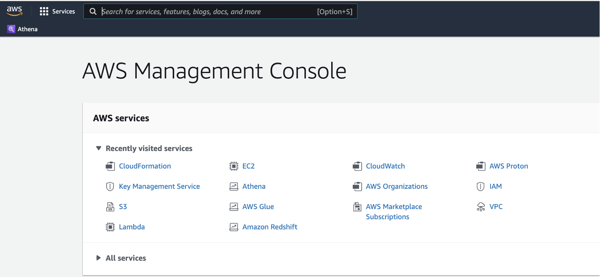
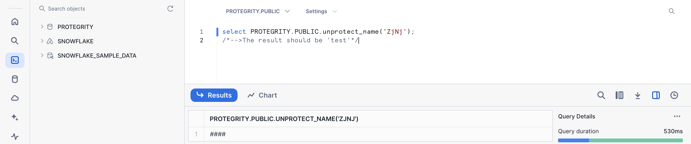

author: Alexandre Charlet
id: protegrity
summary: Enhance Snowflake Data Security with Protegrity's Advanced Tokenization Solutions
<!--- Categories below should be hyphenated, i.e., Getting-Started. Do not leave blank. Visit site for available categories. -->
categories: Getting-Started
environments: web
status: Draft 
feedback link: https://github.com/Snowflake-Labs/sfguides/issues
tags: Getting Started, Data Science, Data Engineering, Twitter 

# Enhance Snowflake Data Security with Protegrity's Advanced Tokenization Solutions
<!-- ------------------------ -->
## Overview 
Duration: 1

We are pleased to introduce Protegrity, a **global leader in data security**, offering advanced data tokenization solutions for Snowflake on **AWS, azure and Snowflake platform**, utilizing a state-of-the-art cloud-native, serverless architecture. Our partnership with Snowflake, established in 2019, underscores our commitment to delivering robust security solutions.

In light of the escalating cyber threat landscape, Protegrity prioritizes the protection of data itself, beyond mere access control measures. 

Protegrity 's solutions ensure transparent protection of sensitive data by default, employing a separation of duties to guarantee that administrative users cannot access data in its clear form. Our scalable solution is designed to **seamlessly handle Snowflake's on-demand, intensive workload processing requirements, delivering both robust security and high performance**.


### Prerequisites
- Basic knowledge on AWS
- Standard knowledge on Snowflake and SQL


### What You’ll Learn
- How to register to Protegrity through Marketplace
- How to deploy Protegrity Snowflake Protector into Snowflake 
- How to deliver data protection at rest and apply separation of duties 

### What You’ll Need 
- AWS account with administrator role 
- Snowflake Trial Account (Enterprise to access to Masking Policy)
- Protegrity Trial Account (Invitation Code for Snowflake Quickstart)

### What You’ll Build 
- A data flow where sensitive data will be protected within Snowflake table at rest and unprotected only for some specific users. 

### Architecture of the deployment 
- This is the architecture used for this quickstart. 


For real use case using an entire flow, please see this [reference architecture on AWS website](https://docs.aws.amazon.com/architecture-diagrams/latest/protegrity-data-protection-for-amazon-s3-and-snowflake/protegrity-data-protection-for-amazon-s3-and-snowflake.html)

<!-- ------------------------ -->
## Prepare Your Lab Environment - Snowflake
Duration: 2

If you haven't already, register for a Snowflake [free 30-day trial](https://trial.snowflake.com/?utm_source=Snowflake&utm_medium=labguide&utm_campaign=dataiku-vhol-download-free-trial-from-lab-guide).

Please select a region which is physically closest to you, and select the Enterprise edition so you can leverage some advanced capabilities that are not available in the Standard Edition.

After registering, you will receive an email with an activation link and your Snowflake account URL. Bookmark this URL for easy, future access. After activation, you will create a user name and password. Write down these credentials.

Resize your browser window, so that you can view this guide and your web browser side-by-side and follow the lab instructions. If possible, use a secondary display dedicated to the lab guide.

By default the sample database SnowflakeSampleData will be accessible, we will need it further. 


<!-- ------------------------ -->
## Prepare Your Lab Environment - AWS
Duration: 2

You can register for an [AWS Protegrity Trial account for Snowflake Quickstart](https://saas.protegrity.com/register?promo=isvQ42024)).


After registering, you will receive an email with all the details and your Protegrity account URL. Bookmark this URL for easy, future access. Write down these credentials.


<!-- ------------------------ -->
## Protegrity Product Deployment
Duration: 20

You need to connect to [Protegrit Cloud Portal](https://saas.protegrity.com).

You will follow the predefined steps to direcly from the portal deploy a new setup that includes:
- New Deployment
- Policy Creation 
- Cloud Protect Deployment into your AWS Account
- Snowflake Protector Deployment 

### 1. New Deployment

#### Click on New Deployment / Click Start SETUP:


#### Fill in account details / AWS Region:


#### AWS account can be copied from here:


### 2. Create Predefined Policy

#### Click on Create New Policy Icon:


#### Configure Security Policy Deployment,fill in Policy Name and KMS Key ARN:


#### Follow these steps to setup the KMS Key:


### 3. Cloud Protect Deployment
#### Click on Start Install


#### Redirection to AWS Portal / Select Acknowledge check:


#### Stack Creation complete:


#### Back to Protegrity Cloud Portal / Click on Continue:


#### Fill in API Gateway ID:


#### See instruction above to find the API Gateway ID:


#### Click on Test and Activate:


#### Then you will see this page with the license actived:


### 4. Smoke test

#### Go to AWS Portal / Click on Lambda function:



#### Click on XXX_protect lambda function:


#### Select Test tab and fill in the following information:

Name: test_lambda_protect

Body:
```json
{
"user": "Protect_user",
"arguments": [
["TEST"]
],
"query_id": 0,
"external_function": "pty_protect_detokname"
}
```
Saves Changes/Select Test Tab
> aside positive
> 
> **Result:** <br> 
> Protected Data: ZjNj


#### Go to AWS Portal / Click on Lambda function


<!-- ------------------------ -->
## Snowflake Protector Deployment Focus
Duration: 15


You will follow the predefined steps on [Protegrity Cloud Portal](https://saas.protegrity.com) to deploy these objects within your Snowflake Account:

- Creation of the database/schema sample
- API creation
- External Function
- Finishing the setup for communication between Snowflake and your AWS account where Protegrity has been deployed. 

### 1. Creation of the database/schema sample

In the context of this quickstart, one Protegrity database is going to be created (however this is not an obligation)

Connect to Snowflake and switch with the account admin role.

#### Click to the database menu on the left and on the + database button


#### Then create a new DB called PROTEGRITY


### 2. Choose the right target platform On Protegrity Cloud Portal

#### Come back to Protegrity Cloud Portal


#### Click on Snowflake / Continue


### 3. Creation of the API / External Function / Communication setup

#### From this page, follow the instructions:


#### In Snowflake, create a SQL Worksheet (+ on the left Menu), Copy the queries from Protegrity Portal, Select the right Database and schema (Protegrity / Public), Run All the queries. 


#### Example of the output of the queries;


#### Follow these steps on AWS account provided by Protegrity Cloud after copying the 2 output values required and clicking on Continue: 


#### Access to the right DB role through IAM on AWS:


#### Edit Trust Policy, copy the policy json text from Protegrity Cloud and update the policy:


#### Once it's done come back to Protegrity Cloud Portal and click on done


<!-- ------------------------ -->
## Static Policy Definition
Duration: 5
Protegrity Trial Static Policy


In Protegrity Static Policy, users have been associated with different Protegrity roles. These roles have different privileges when protection/unprotection is applied. 
- Leel from Customer Support 
- Sandersa from Finance 
- Protect_user to process protection
- Other users that are not defined can't apply any protection / unprotection  

> aside positive
> This configuration is setup for trial version. Protegrity Data Security Policies are defined by  the customer in a real case. 


### Policy Definition


<!-- ------------------------ -->
## Users Creation on Snowflake
Duration: 5

Users Creation on Snowflake is related to Protegrity Trial Static Policy. 


Please create on Snowflake these users with this configuration: sandersa, leel, dba_user and Protect_User. 

```sql
CREATE USER sandersa PASSWORD='abc123' DEFAULT_ROLE = accountadmin DEFAULT_SECONDARY_ROLES = ('ALL') MUST_CHANGE_PASSWORD = FALSE;

CREATE USER leel PASSWORD='abc123' DEFAULT_ROLE = accountadmin DEFAULT_SECONDARY_ROLES = ('ALL') MUST_CHANGE_PASSWORD = FALSE;

CREATE USER protect_user PASSWORD='abc123' DEFAULT_ROLE = accountadmin DEFAULT_SECONDARY_ROLES = ('ALL') MUST_CHANGE_PASSWORD = FALSE;

CREATE USER dba_user PASSWORD='abc123' DEFAULT_ROLE = accountadmin DEFAULT_SECONDARY_ROLES = ('ALL') MUST_CHANGE_PASSWORD = FALSE;

grant usage on database PROTEGRITY to role accountadmin;
grant usage on schema PROTEGRITY.PUBLIC to role accountadmin;
grant select on future tables in schema PROTEGRITY.PUBLIC to role accountadmin;
grant role accountadmin to user PROTECT_USER;
grant role accountadmin to user SANDERSA;
grant role accountadmin to user LEEL;
grant role accountadmin to user DBA_USER;
```

<!-- ------------------------ -->
## Unit Test of Protegrity Function
Duration: 5


### Run these queries throught Snowflake SQL Worksheet: 

```sql
/* Connect with Protect_User
Run Sql to protect name */

select PROTEGRITY.PUBLIC.protect_name('TEST'); 
/*-->The result should be 'ZjNj'

Run Sql to unprotect name */

select PROTEGRITY.PUBLIC.unprotect_name('ZjNj');
/*-->The result should be 'ZjNj'

Connect with Leel 
Run Sql to unprotect name*/

select PROTEGRITY.PUBLIC.unprotect_name('ZjNj');
/*-->The result should be 'TEST'

Connect with Sandersa 
Run Sql to unprotect name*/

select PROTEGRITY.PUBLIC.unprotect_name('ZjNj');
/*-->The result should be '####'*/

```

#### See one example with user Sandersa:



<!-- ------------------------ -->
## Enhance Snowflake Data Security with independent separation of duties. 
Duration: 15

We will implement a standard Use Case where sensitive data is protected by default and separation of duties needs to be applied with a control that is managed by a privacy/security/data owner team.

### Data Protection
Applying Data Protection at rest can be achieved in several ways:
- Protection is already applied at source before data is moved to Snowflake
- Protection can be applied within a streaming flow


- Protection can be applied once the data has been stored


**The last option is going to be implemented with you.**

#### Run these queries: 

```sql
We can show a standard Update buy maybe we should use an insert into sql... Advice from Snowflake is required 

These functions needs to used to protect data:
 C_FIRST_NAME and C_LAST_NAME: PROTEGRITY.PUBLIC.protect_name()
C_BIRTH_YEAR: PROTEGRITY.PUBLIC.protect_numeric()
C_BIRTH_COUNTRY: PROTEGRITY.PUBLIC.protect_county()
C_EMAIL_ADDRESS: PROTEGRITY.PUBLIC.protect_email_domain()
```


### Data Unprotection

#### Through a View 
Protegrity has been designed **to minimize the impact** on existing data consumers. To do that, most Protegrity customers create new table Views that enforce the Protegrity data protection policy at runtime.

While creating **new views is relatively simple**, it does require **extra work for developers and results in changes to the database schema and structure**. For end-users, the view name can be the same as the original table name, and thus minimize how users access the data. 


Run these queries to create a view: 

```sql
These functions needs to used to protect data:
 C_FIRST_NAME and C_LAST_NAME: PROTEGRITY.PUBLIC.unprotect_name()
C_BIRTH_YEAR: PROTEGRITY.PUBLIC.unprotect_numeric()
C_BIRTH_COUNTRY: PROTEGRITY.PUBLIC.unprotect_county()
C_EMAIL_ADDRESS: PROTEGRITY.PUBLIC.unprotect_email_domain()
```

Run these queries to see the different results depending on the user: 
```sql
...
```

#### Through a Masking Policies 
**Creating masking policies and attaching** them to the right tables and columns is a more efficient mechanism than creating new views. Further, this improves data access functionality, whether by direct end-user queries, BI platforms, or other connected data flows.
The **complexity of implemention and application** of such masking policies is **very low** for database developers. As **for end-users**, there is **no change** to how they accessed the data previously. If a user has the permission to see data in the detokenized  format, the detokenization will be applied at run-time.

Run these queries to create the masking policies: 
```sql
...
```

Run these queries to see the different results depending on the user: 
```sql
...
```


## Conclusion & Next Steps
Duration: 2
Protegrity and Snowflake ensures a double separation of duties, one controled by Customer Snowflake administrators and other by Customer Security, Data Owner teams. 

This solution will ensure data is protected by default at rest. 

This tutorial was designed as a hands-on introduction to Snowflake and Protegrity to simultaneously teach you how to use it, while showcasing some of its key capabilities.

We encourage you to continue with your free trial by loading in your own sample or production data and by using some of the more advanced capabilities of Snowflake not covered in this lab. 

If you need any information, Contact [Sales]().

